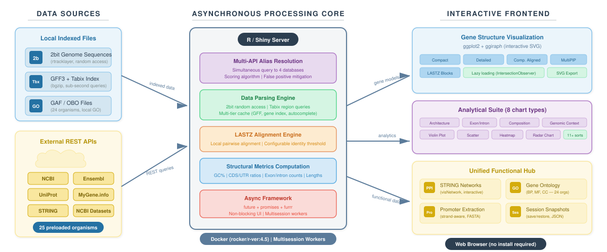

# CGV

**Comparative Gene Viewer** is an interactive R/Shiny web application for comparative gene visualization and functional analysis across species. It combines local indexed genomes and annotations with live queries to public resources so researchers can move from a gene symbol to structural, comparative, and functional context in a single interface.

[](https://cgv.mobilomics.org)
[](https://www.r-project.org/)
[](LICENSE)

## Code signing policy

Windows release signing follows the [CGV Desktop code signing policy](desktop/legal/CODE_SIGNING_POLICY.md). Free code signing is intended to be provided by [SignPath.io](https://about.signpath.io/), certificate by [SignPath Foundation](https://signpath.org/), once the project is accepted. See also the [privacy policy](desktop/legal/PRIVACY.md) and [third-party notices](desktop/legal/THIRD_PARTY_NOTICES.md).



## Why CGV

CGV was designed to reduce the fragmented workflow common in comparative genomics. Instead of switching between genome browsers, orthology resources, Gene Ontology portals, promoter utilities, and protein-network tools, users can explore these layers from one web application.

Completed analyses can also be preserved as a portable, versioned
reproducibility ZIP. Web deployments can publish the same snapshot as an
expiring secret read-only report with interactive SVGs and sortable tables;
Desktop exports an equivalent self-contained HTML file without uploading data.

Key capabilities include:

- gene-centered search without requiring prior genomic coordinates
- homologous and orthologous visualization workflows
- local rendering from indexed `GFF3 + Tabix` and genome `2bit` files
- Gene Ontology lookup from local GO annotations
- promoter extraction and sequence retrieval
- integrated comparative analytics and exportable figures
- containerized deployment with datasets mounted as external volumes

## Repository Scope

This GitHub repository is intended to host the **application source code, configuration, documentation, and lightweight registries**.

Large biological resources are **not versioned in GitHub**:

- reference genomes (`genomes/`)
- annotation files (`annotations/`)
- GO annotation files and ontology assets (`go_annotations/`)
- generated caches (`cache/`)

This separation keeps the repository lightweight, reproducible, and aligned with GitHub's file and repository size recommendations.

For the data-management policy used by the project, see [DATA_AVAILABILITY.md](DATA_AVAILABILITY.md).

<details>
<summary><strong>What is tracked in GitHub?</strong></summary>

- application source code
- Docker and deployment configuration
- documentation and figures
- scripts used to build registries and caches
- lightweight registry files describing supported organisms and resources

</details>

<details>
<summary><strong>What is intentionally kept out of GitHub?</strong></summary>

- production genome files
- compressed annotation datasets and indexes
- raw GO annotation archives
- generated runtime caches
- machine-specific local environment files

</details>

## Data Strategy

CGV is built around a code/data split:

- GitHub: source code, Docker files, scripts, registries, documentation
- Zenodo or institutional repository: frozen release snapshots, software DOI, optional curated small example dataset
- external/local storage: full production genomes, annotations, GO resources, and caches

In practice, the recommended publication workflow is:

1. Keep the public GitHub repository focused on code and small metadata files.
2. Archive each software release in Zenodo to obtain a DOI for citation.
3. Archive full heavy datasets separately only if the journal or funder requires redistribution.
4. Provide machine-readable registries and clear download/rebuild instructions for any data not redistributed directly.

<details>
<summary><strong>Recommended publication package</strong></summary>

1. GitHub repository with code and documentation
2. Zenodo-linked software release DOI
3. optional lightweight demo dataset for reviewers
4. manuscript-ready citation metadata

</details>

## Quick Start

### Docker

```bash
cp .env.example .env
docker compose build
docker compose up -d
```

Then open `http://localhost:3838`.

### Required mounted data

The application expects the following directories to be available at runtime:

- `annotations/`
- `genomes/`
- `go_annotations/`
- `cache/`

By default, `docker-compose.yml` mounts them as volumes:

```yaml
volumes:
  - ${CGV_ANNOTATIONS_DIR:-./annotations}:/app/annotations:ro
  - ${CGV_GENOMES_DIR:-./genomes}:/app/genomes:ro
  - ${CGV_GO_ANNOTATIONS_DIR:-./go_annotations}:/app/go_annotations:ro
  - ${CGV_DATA_DIR:-./data}:/app/data:ro
  - ${CGV_CACHE_DIR:-./cache}:/app/cache
```

For deployment details, see [DOCKER_DEPLOY.md](DOCKER_DEPLOY.md).

### LASTZ resource and cache policy

- Web containers run at most one LASTZ job concurrently (`APP_LASTZ_WORKERS=1`); Desktop uses up to two when the machine has enough CPUs.
- ShinyProxy sessions and the detached report worker also share a filesystem semaphore. Colors uses `APP_LASTZ_GLOBAL_WORKERS=2`; other deployments default to one unless explicitly tuned, so excess alignments wait instead of competing without a bound.
- LASTZ Blocks and MultiPIP share one General+CIGARX alignment for the same reference, loci, window, binary, and arguments. Changing the alignment window creates a new exact alignment instead of cropping a larger approximation.
- The in-memory cache is bounded by both entry count and bytes. Successful alignments for preloaded genomes may also use the shared `cache/lastz_alignments` disk cache, bounded by size and TTL.
- Uploaded/private genome paths are excluded from the persistent cache. Timeouts and engine errors are never cached.

The main controls are `APP_LASTZ_CACHE_MAX_ENTRIES`, `APP_LASTZ_CACHE_MAX_MB`, `APP_LASTZ_DISK_CACHE_MAX_MB`, and `APP_LASTZ_DISK_CACHE_TTL_DAYS`.

### Background interactive reports

Web users can choose **Email me** in Share analysis or **Email full report**
beside the Multi-Gene and Cross-Species LASTZ/MultiPIP controls. CGV stores an
immutable work-session snapshot in the shared cache, and the serial
`background-report-worker` restores it in an internal Shiny session. Google
Chrome headless drives the existing complete capture pipeline, so the emailed secret
URL opens the same interactive, read-only report produced in the foreground.
The user may continue working or close the original ShinyProxy session after
the job is queued; later changes create a separate snapshot and do not alter the
queued report. Background delivery initially accepts portable/preloaded data,
not session-private uploads.

<details>
<summary><strong>First-time deployment checklist</strong></summary>

1. clone the repository
2. create `.env` from `.env.example`
3. point the volume variables to your local dataset directories
4. build and start with Docker Compose
5. optionally prewarm cache/indexes for faster first use

</details>

## Minimal Reproducible Layout

```text
.
├── R/
├── annotations/
│   ├── README.md
│   └── registry.tsv
├── genomes/
│   ├── README.md
│   └── registry.tsv
├── go_annotations/
│   ├── README.md
│   └── registry.tsv
├── data/
│   └── alias_index/
├── scripts/
├── www/
├── Dockerfile
├── docker-compose.yml
├── global.R
├── server.R
└── ui.R
```

## Reproducibility Notes

- Production deployments mount large datasets as external volumes instead of baking them into the image.
- `.dockerignore` excludes heavy biological directories from image builds.
- Registry files document which organisms and resources are expected by the app.
- Cache files can be precomputed, but they are generated artifacts and should not be committed.

## Citation

If you use CGV in research, please cite the associated manuscript and the software release DOI once the archival record is published.

Planned repository metadata for publication:

- `CITATION.cff`
- optional `.zenodo.json`
- GitHub release tags linked to Zenodo

Repository citation metadata is provided in [CITATION.cff](CITATION.cff).

<details>
<summary><strong>Planned citation workflow</strong></summary>

- create a tagged GitHub release
- let Zenodo archive that release automatically
- cite the manuscript and the DOI corresponding to the archived release

</details>

## Availability

- Source code: this repository
- Web deployment: `https://cgv.mobilomics.org`
- Release archive / DOI: Zenodo record to be added

## License

Distributed under the [MIT License](LICENSE).

## Contact

For questions about deployment, reproducibility, or scientific use, please open an issue in this repository once the public release is finalized.
